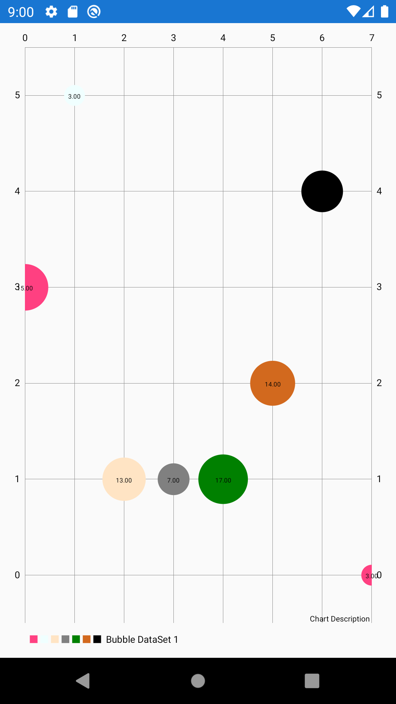
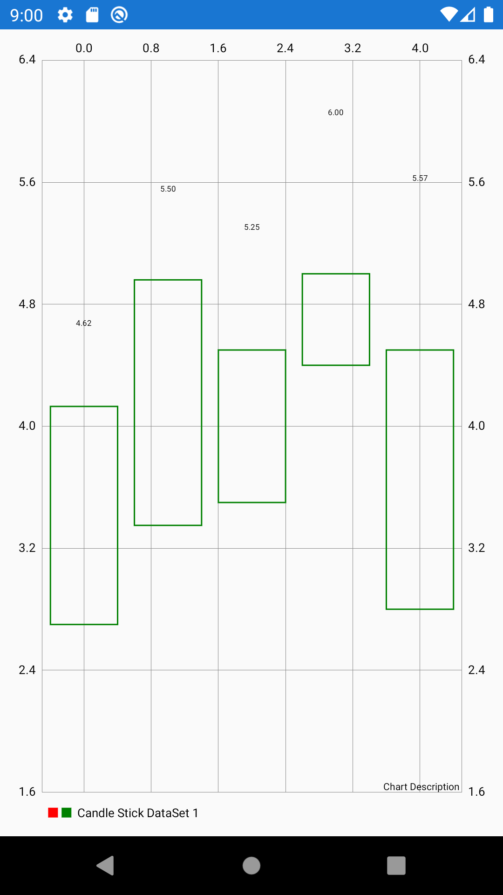
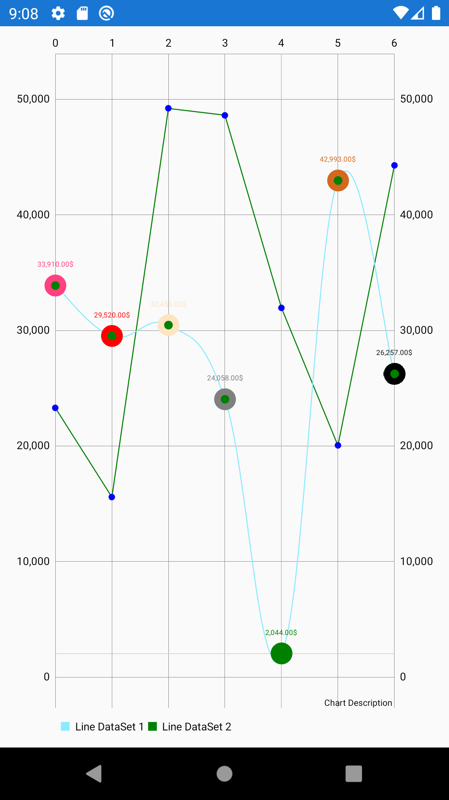
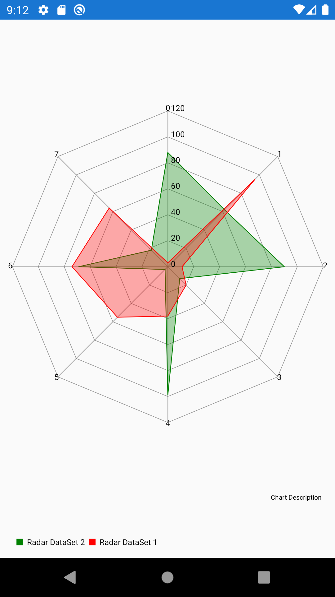

# GraphInXamarinForms
MPAndroidChart/iOSChart for Xamarin Forms Custom Renderer
Based on: https://github.com/bulubuloa/Ultimate-Xamarin-Forms-KIT  
Nuget: https://www.nuget.org/packages/UltimateXF/

## Features
* Bar Chart
* Bubble Chart
* Candle Stick Chart
* Combined Chart Page
* Horizontal Bar Chart
* Line Chart
* Pie Chart
* Radar Chart
* Scatter Chart

## Preview
 &nbsp;&nbsp;&nbsp;  &nbsp;&nbsp;&nbsp;   
 &nbsp;&nbsp;&nbsp;  &nbsp;&nbsp;&nbsp;   
 &nbsp;&nbsp;&nbsp;  &nbsp;&nbsp;&nbsp;   

